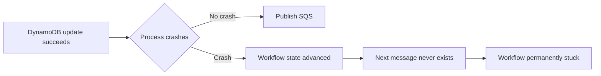
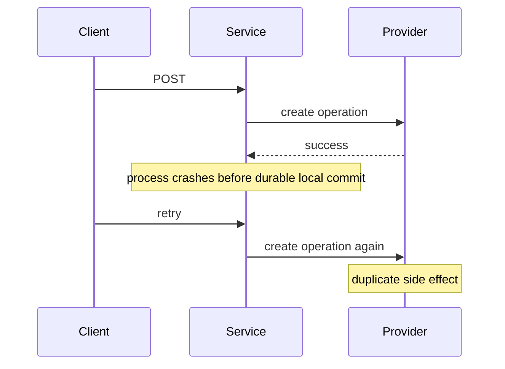

# Reliability Review

Perform a production-grade, read-only reliability review.

Do not modify files.

Do not automatically fix findings.

Do not weaken an invariant because remediation is difficult.

Do not report PASS based only on happy-path tests.

Review scope:

`$ARGUMENTS`

If no scope is supplied, review the current working-tree change set.

---

# 1. Objective

Determine whether the reviewed change can safely operate in a distributed,
failure-prone production environment.

The review must specifically look for conditions that can cause:

- silent loss of work
- duplicate business side effects
- incorrect retries
- cross-request result mismatch
- workflow state corruption
- stuck workflows
- incorrect terminal state
- ambiguous external operation state
- lost events
- poison-message loops
- unbounded retries
- infrastructure timeout races
- incorrect assumptions about AWS delivery guarantees
- unrecoverable failures
- missing observability for critical failure paths

The target architecture assumes:

```text
Client
  |
  v
ALB
  |
  v
ECS/Fargate HTTP API
  |
  +---- DynamoDB
  |       authoritative workflow state
  |
  +---- SQS
          |
          v
       Lambda worker
          |
         SQS
          |
         ...
          |
          v
       finalizer
          |
          v
       DynamoDB
          ^
          |
   bounded polling
          |
          v
   same HTTP request
```

DynamoDB is the authoritative source of business workflow state.

SQS is transport.

HTTP lifecycle is not business-operation lifecycle.

---

# 2. Required project context

Before reviewing implementation, read these files when present:

1. `CLAUDE.md`
2. `docs/invariants.md`
3. `docs/architecture.md`
4. `docs/state-machine.md`
5. relevant files under `docs/adr/`
6. relevant phase document under `docs/phases/`
7. root `package.json`
8. relevant application source
9. relevant CDK/infrastructure source
10. relevant tests

If an invariant document conflicts with implementation, implementation is
considered wrong unless an approved ADR explicitly changes the invariant.

---

# 3. Establish the review scope

Start by inspecting:

```bash
git status --short
git diff --stat
git diff
```

If `$ARGUMENTS` identifies a base ref, path, or explicit scope, adapt the
inspection accordingly.

Report exactly what is being reviewed.

Identify changed:

- HTTP handlers
- workflow services
- repositories
- DynamoDB operations
- SQS producers
- SQS consumers
- Lambda functions
- external API integrations
- schemas/contracts
- CDK resources
- IAM
- timeout configuration
- tests

Do not assume a change is isolated to one file.

Trace dependencies and callers where necessary.

---

# 4. Reliability model

Assume all of the following are normal production events:

```text
network timeout
network partition
client disconnect
client retry
process crash
container restart
Lambda retry
duplicate SQS delivery
delayed SQS delivery
out-of-order message delivery
partial batch failure
DynamoDB conditional conflict
external API timeout
external API success with lost response
deployment during traffic
ECS task termination
dependency throttling
dependency temporary outage
```

A design is not reliable if correctness depends on these events never
happening.

---

# 5. Severity levels

Use exactly these severities.

## CRITICAL

Use when there is a credible path to:

- duplicate irreversible business side effect
- lost business operation
- false successful result
- unrecoverable ambiguous external state
- cross-request or cross-tenant result corruption
- permanent workflow inconsistency
- committed state with permanently lost continuation
- security boundary violation affecting business state

CRITICAL always blocks acceptance.

---

## HIGH

Use for significant correctness or recovery failures such as:

- non-idempotent SQS consumer
- missing conditional write on critical workflow transition
- terminal state can be overwritten
- missing DLQ for production processing queue
- unsafe retry policy
- missing partial batch failure handling
- incorrect visibility timeout
- correctness-critical failure path has no test
- required tests fail
- infrastructure configuration contradicts a required invariant

HIGH always blocks acceptance.

---

## MEDIUM

Use for operational or scalability risks such as:

- missing DLQ alarm
- insufficient queue-age monitoring
- weak observability
- recoverable retry semantics not documented
- polling strategy likely to cause unnecessary load
- missing PITR where production recovery requires it
- eventual read causes avoidable completion latency
- scale assumptions unsupported by load testing

MEDIUM does not automatically block a development merge but prevents a clean
production-readiness PASS.

---

## LOW

Use for:

- maintainability
- naming
- diagnostic quality
- minor inefficiency
- test clarity
- documentation gaps that do not threaten correctness

---

# 6. Review invariant: request identity

Every logical operation must have one immutable:

```text
requestId
```

Externally retriable operations must also have:

```text
idempotencyKey
```

Verify that:

- `requestId` identifies one workflow
- client retries reuse the logical idempotency identity
- the same client retry cannot create two business operations
- `requestId` propagates through every queue hop
- final result is correlated only by immutable workflow identity

Search:

```bash
rg -n "requestId|idempotencyKey|idempotency|operationId|correlationId" apps packages tests
```

Do not accept correlation based only on:

- customer ID
- timestamp
- ECS task
- Lambda invocation
- socket
- local Promise
- connection ID

### HIGH

Report HIGH if HTTP retries can start multiple workflows for one logical
operation.

### CRITICAL

Report CRITICAL if correlation can return the result of one operation to
another request or tenant.

---

# 7. Review invariant: HTTP lifecycle != business lifecycle

Verify that:

```text
HTTP timeout
```

does not automatically imply:

```text
workflow FAILED
```

A workflow may complete after the synchronous HTTP deadline.

Trace:

```text
client timeout
ALB timeout
ECS wait timeout
business synchronous deadline
workflow deadline
worker timeout
```

Verify deliberate ordering rather than identical timeout values everywhere.

Expected conceptual relationship:

```text
business synchronous wait deadline
<
ECS/server connection budget
<
ALB idle timeout
<
recommended client timeout
```

Exact values are configuration-dependent.

### HIGH

Report HIGH if infrastructure timeout can fire before application code has a
chance to produce the intended controlled response.

### HIGH

Report HIGH if HTTP disconnect or wait expiration corrupts durable workflow
state.

---

# 8. Idempotency review

Search:

```bash
rg -n "idempot|dedup|messageId|requestId|stepId|operationId" apps packages tests
rg -n "makeIdempotent|DynamoDBPersistenceLayer" apps packages
```

For every changed operation determine its idempotency class:

```text
NATURALLY_IDEMPOTENT
IDEMPOTENCY_PROTECTED
RECONCILABLE
UNSAFE
```

Verify:

- HTTP retries are idempotent
- SQS retries are idempotent
- worker crashes do not repeat unsafe effects
- duplicate completion is harmless
- provider-side idempotency keys are stable across retries
- local idempotency records are durable where needed

Do not accept in-memory deduplication as production idempotency.

### CRITICAL

An irreversible external side effect can execute twice after retry/crash.

### HIGH

A worker performs non-idempotent internal work with no durable deduplication.

---

# 9. External API review

For every external side effect changed by the scope, identify:

- provider
- operation
- provider idempotency support
- provider lookup/reconciliation support
- stable external reference
- retry policy
- timeout semantics
- 4xx handling
- 5xx handling
- connection failure handling
- unknown-state handling

Model this failure explicitly:

```text
external API receives operation
        |
        v
operation succeeds remotely
        |
        v
response is lost OR local process crashes
        |
        v
our local durable state was not updated
        |
        v
retry occurs
```

The implementation must answer:

```text
How do we know whether the remote operation already happened?
```

Accepted answers:

1. same provider idempotency key
2. reconciliation lookup using immutable operation reference
3. another documented deterministic mechanism

Not accepted:

```text
we assume timeout means failure
```

### CRITICAL

Report CRITICAL when remote success is possible but retry can blindly repeat a
non-idempotent side effect.

---

# 10. DynamoDB state-transition review

Search:

```bash
rg -n "UpdateCommand|UpdateItemCommand|PutCommand|PutItemCommand|DeleteCommand|TransactWrite" apps packages
rg -n "ConditionExpression|attribute_not_exists|attribute_exists|ReturnValuesOnConditionCheckFailure" apps packages
```

For every business-state mutation determine:

```text
current state
requested transition
legal previous states
terminal states
concurrent actors
retry behavior
```

Write the transition explicitly, for example:

```text
PROCESSING -> COMPLETED
```

Then verify DynamoDB enforces it.

Expected conceptual protection:

```text
ConditionExpression:
status == PROCESSING
```

Create-if-absent should use a uniqueness condition when required.

Example:

```text
attribute_not_exists(pk)
```

### HIGH

Critical workflow transition uses unconditional update.

### CRITICAL

Concurrent execution can overwrite one terminal business result with another.

---

# 11. Terminal state review

Terminal workflow states must be immutable unless an explicit ADR says
otherwise.

Example:

```text
PROCESSING -> COMPLETED
PROCESSING -> FAILED
```

Forbidden:

```text
COMPLETED -> FAILED
FAILED    -> COMPLETED
COMPLETED -> PROCESSING
FAILED    -> PROCESSING
```

Verify duplicate workers cannot alter terminal state.

Verify late messages cannot alter terminal state.

Verify timeout paths cannot alter terminal state incorrectly.

---

# 12. Dual-write review

Search:

```bash
rg -n "SendMessageCommand|SendMessageBatchCommand|PublishCommand|PutEvents" apps packages
rg -n "TransactWrite|OUTBOX|outbox|DynamoDBStream|streamViewType" apps packages infrastructure
```

For every path that performs both:

```text
durable state change
+
message/event publication
```

model both failure windows.

## Failure A

```text
database write succeeds
        |
        X process crashes
        |
message never published
```

Ask whether the workflow can become permanently stuck.

## Failure B

```text
message published
        |
        X process crashes / DB write fails
        |
database does not reflect publication
```

Ask whether retry can duplicate downstream work.

Unsafe pattern:

```ts
await updateState();
await sendToSqs();
```

when failure between these operations can permanently lose workflow
progression.

Preferred solution where atomic progression is required:

```text
DynamoDB transaction
  |
  +-- business state
  |
  +-- OUTBOX item

DynamoDB Stream / publisher
  |
  v
SQS
```

### CRITICAL

A DB + event dual-write crash window can permanently lose a workflow
continuation or create irreconcilable state.

---

# 13. Transactional outbox review

If an outbox exists, verify:

- state and outbox event are written atomically
- outbox event has immutable event ID
- duplicate stream processing is safe
- publisher is idempotent
- downstream consumer is idempotent
- failure to publish is observable/retriable
- poison outbox events have an operational failure path
- "published" marker is not the only deduplication guarantee

Do not assume DynamoDB Streams provides exactly-once delivery.

---

# 14. SQS delivery semantics review

Assume SQS/Lambda processing can occur more than once.

Search:

```bash
rg -n "SQSHandler|SQSEvent|SQSRecord|SqsEventSource|EventSourceMapping" apps packages infrastructure
```

For each consumer verify:

- duplicate delivery is safe
- message body is validated
- business idempotency identity is known
- retry behavior is known
- poison-message behavior is known
- external effects are protected
- next-state mutation is protected

Never approve code merely because SQS FIFO deduplication is enabled.

Infrastructure delivery guarantees do not replace business idempotency.

---

# 15. Partial batch failure review

Search:

```bash
rg -n "reportBatchItemFailures|ReportBatchItemFailures|BatchProcessor|processPartialResponse|batchItemFailures" apps packages infrastructure
```

For batched SQS Lambda consumers verify:

- event source enables partial batch responses
- handler returns correct failed message identifiers
- successfully processed records are not reported failed
- failed records are not silently swallowed

Test scenario:

```text
A succeeds
B fails
C succeeds
```

Expected for Standard SQS:

```text
only B is returned as failed
```

### HIGH

A single poison record unnecessarily causes successful batch items to repeat
when partial batch handling should be used.

---

# 16. FIFO review

If FIFO is used, inspect:

```bash
rg -n "fifo|MessageGroupId|MessageDeduplicationId" apps packages infrastructure
```

Verify:

- FIFO is actually required by business ordering
- `MessageGroupId` has correct cardinality
- message grouping will not create a hot serialized bottleneck
- a failed message does not allow later dependent messages to corrupt ordering
- application remains idempotent

Do not describe FIFO as eliminating the need for idempotent consumers.

---

# 17. Lambda/SQS visibility timeout review

Read the actual:

```text
Lambda timeout
SQS visibility timeout
maximum batching window
```

from infrastructure.

For Lambda SQS event-source mappings calculate:

```text
minimumVisibility =
    6 * lambdaTimeout
    + maximumBatchingWindow
```

Verify:

```text
queue.visibilityTimeout >= minimumVisibility
```

Example:

```text
Lambda timeout = 30 seconds
batch window   = 5 seconds

minimum visibility =
6 * 30 + 5
= 185 seconds
```

### HIGH

Configured visibility timeout is below the required calculated value.

Do not trust comments if CDK configuration says something else.

---

# 18. DLQ review

Search:

```bash
rg -n "deadLetterQueue|dead.?letter|maxReceiveCount|redrive" infrastructure apps
```

For every production processing queue verify:

- compatible DLQ exists
- redrive policy exists
- max receive count is deliberate
- DLQ retention is appropriate
- source/DLQ type compatibility is correct
- DLQ message arrival is monitored
- operational recovery/redrive path exists

For Lambda/SQS, treat `maxReceiveCount >= 5` as the default starting point
unless project-specific evidence or ADR justifies another value.

### HIGH

No DLQ for business-critical production queue.

### MEDIUM

DLQ exists but no alarm or recovery runbook exists.

---

# 19. Queue monitoring review

Search:

```bash
rg -n "Alarm|cloudwatch.Alarm|ApproximateNumberOfMessagesVisible|ApproximateAgeOfOldestMessage" infrastructure
```

Verify monitoring exists where relevant for:

```text
DLQ visible messages
oldest message age
queue backlog
Lambda errors
Lambda throttles
workflow failures
workflow timeout rate
```

For business SLA queues, `ApproximateAgeOfOldestMessage` should normally be
monitored.

A DLQ without monitoring is not a complete failure mechanism.

---

# 20. Retry classification

Every important failure should fall into:

```text
RETRYABLE
NON_RETRYABLE
UNKNOWN_EXTERNAL_STATE
```

Review catch/retry code.

Search:

```bash
rg -n "retry|backoff|catch|throw|429|500|502|503|504|timeout|ECONNRESET|ETIMEDOUT" apps packages
```

Verify:

### RETRYABLE

Examples:

```text
temporary AWS throttling
temporary network issue
provider 503 when operation is retry-safe
```

### NON_RETRYABLE

Examples:

```text
schema validation failure
business validation failure
unsupported request
```

### UNKNOWN_EXTERNAL_STATE

Examples:

```text
request transmitted to external provider
connection drops before response
provider may have executed operation
```

`UNKNOWN_EXTERNAL_STATE` must not automatically enter blind retry for
non-idempotent operations.

---

# 21. Polling review

If the synchronous HTTP API waits through DynamoDB polling, verify polling is:

- bounded
- deadline-aware
- configurable
- backoff-based
- jittered
- abort-aware when possible
- not an unbounded busy loop

Search:

```bash
rg -n "ConsistentRead|setTimeout|sleep|poll|backoff|jitter|deadline" apps packages
```

Expected conceptual pattern:

```text
short initial polling interval
       |
       v
progressive backoff
       |
       v
bounded max interval
       |
       v
absolute deadline
```

Check whether strongly consistent `GetItem` is used for the authoritative
completion record where immediate visibility of the terminal state is required.

### MEDIUM

Polling is fixed high-frequency and likely to generate avoidable DynamoDB load.

### HIGH

Polling has no hard deadline.

### HIGH

A polling timeout mutates business status incorrectly.

---

# 22. DynamoDB consistency review

DynamoDB reads are eventually consistent by default.

When code decides:

```text
Has the authoritative workflow reached a terminal state?
```

verify the chosen consistency model is intentional.

For base-table `GetItem`, strongly consistent read may be appropriate:

```ts
ConsistentRead: true;
```

Do not assume a GSI can provide strongly consistent reads.

### HIGH

A correctness decision relies on an eventually consistent index as though it
were authoritative latest state.

---

# 23. DynamoDB transaction review

Search:

```bash
rg -n "TransactWriteCommand|TransactWriteItemsCommand|ClientRequestToken" apps packages
```

When multiple DynamoDB mutations form one invariant, verify:

- transaction is used
- conditions are applied
- retry behavior is defined
- transaction conflicts are handled
- idempotent transaction retry uses stable token when required
- no action attempts to mutate the same item twice inside one transaction

Do not approve `BatchWriteItem` as a replacement for an atomic conditional
transaction.

---

# 24. Client retry review

Model:

```text
client POST
    |
server accepts request
    |
workflow starts
    |
HTTP response is lost
    |
client retries
```

Verify retry with the same logical idempotency key:

```text
does NOT create another workflow
```

If existing workflow is:

```text
PROCESSING
```

the retry should recover/continue the existing logical operation according to
the API contract.

If existing workflow is:

```text
COMPLETED
```

the retry should return the original durable result when appropriate.

### CRITICAL

Retry can repeat an irreversible business operation.

---

# 25. ECS crash review

Model:

```text
HTTP request
   |
   v
ECS Task A
   |
   X crash
```

Correctness requirements:

- workflow state survives
- SQS work survives
- business operation can finish
- client can retry safely
- another task can recover using durable state

The original TCP/HTTP connection cannot be guaranteed across process failure.
Do not flag that alone as a system bug.

Flag instead if business correctness depends on ECS memory.

### HIGH

Workflow identity/state exists only in ECS memory.

---

# 26. ECS deployment/draining review

When ECS/ALB infrastructure is in scope verify:

- multiple ECS tasks in production
- health checks
- readiness changes during drain
- SIGTERM handling
- server stops accepting new requests during shutdown
- ALB deregistration delay is compatible with max synchronous request duration
- deployment does not intentionally destroy in-flight work
- workflow correctness does not depend on graceful shutdown succeeding

Search:

```bash
rg -n "SIGTERM|server.close|ready|health|deregistration|idleTimeout|Fargate|desiredCount" apps infrastructure
```

### HIGH

Container shutdown can corrupt business workflow state.

### MEDIUM

Graceful draining is absent but durable workflow recovery is otherwise safe.

---

# 27. Large-payload review

Search for large objects embedded in:

- SQS messages
- DynamoDB items
- logs

Large workflow input/result should generally be externalized to durable object
storage such as S3 when it can exceed practical message/item limits.

Verify SQS messages contain references where appropriate.

### HIGH

Payload can exceed a hard AWS service limit with no guard.

### MEDIUM

Large payload architecture creates avoidable scaling/cost risk.

---

# 28. Security/correlation review

Verify:

- caller cannot set internal workflow state
- caller cannot provide arbitrary queue URL
- caller cannot choose internal AWS resource
- tenant identity comes from authenticated context
- result access validates ownership
- `requestId` alone is not authorization
- secrets are not logged
- AWS permissions are least privilege where practical

### CRITICAL

One tenant can retrieve or affect another tenant's workflow/result.

---

# 29. Failure-path testing

Search:

```bash
rg -n "duplicate|idempot|retry|timeout|DLQ|dead.?letter|conditional|ConditionalCheckFailed|outbox|partial batch|batchItemFailures|crash|reconcil|poison" tests apps packages
```

For every changed reliability mechanism require relevant failure-path tests.

Required scenarios where applicable:

```text
duplicate HTTP request
duplicate SQS message
duplicate terminal completion
conditional state race
worker crash
mixed successful/failed SQS batch
poison message
DLQ transition
external provider timeout
external success then local crash
DB success then publish failure
HTTP timeout before business completion
client disconnect
ECS restart
outbox duplicate processing
late message after terminal state
```

### HIGH

Correctness-critical behavior changed without a corresponding failure-path
test.

---

# 30. Test-quality review

Do not count a test merely because its name contains:

```text
idempotency
retry
timeout
```

Read the test.

Verify it actually proves the invariant.

Bad test:

```text
expects function to return 200
```

Good reliability test:

```text
execute same logical SQS operation twice
assert external side effect happened exactly once
assert durable state remains correct
```

Tests must prove externally relevant behavior rather than internal method calls
where possible.

---

# 31. Infrastructure-as-code review

Production AWS behavior must be represented in CDK or another approved IaC
source.

Do not accept:

```text
configured manually in AWS console
```

as sufficient proof.

Inspect actual CDK definitions.

Pay special attention to:

- SQS
- Lambda event source mappings
- DynamoDB
- ECS
- ALB
- IAM
- alarms
- DLQs
- encryption
- PITR
- retention/removal policies
- security groups

---

# 32. Required commands

Inspect `package.json` first.

Run these when they exist and apply to the scope:

```bash
pnpm lint
pnpm typecheck
pnpm test
pnpm test:integration
```

When relevant:

```bash
pnpm test:e2e
```

When infrastructure changed:

```bash
pnpm cdk:synth
pnpm cdk:diff
```

Do not invent missing commands.

Report:

```text
NOT_AVAILABLE
```

when a command does not exist.

Report:

```text
NOT_APPLICABLE
```

when it exists but is unrelated to the reviewed scope.

A required failing command is normally HIGH.

Do not hide failures.

---

# 33. Inspect final diff

Before finalizing the review, inspect:

```bash
git diff
```

again.

Confirm test execution did not unexpectedly modify tracked files.

Trace at least:

- one complete success path
- every new terminal failure path
- every changed external side-effect path
- every changed state + publish path

---

# 34. Mandatory crash-window analysis

For each workflow step that contains multiple durable/network operations,
mentally place a process crash:

```text
before operation A
after operation A
before operation B
after operation B
```

Ask after every crash point:

```text
What durable state remains?

What will retry do?

Can the operation happen twice?

Can the workflow become stuck?

Can the next worker still run?

Can we determine the real external outcome?
```

A workflow is not reliable merely because happy-path code is sequential.

---

# 35. Mandatory timeout-race analysis

For timeout-sensitive code model:

```text
result arrives just before timeout
result arrives exactly during timeout
result arrives just after timeout
HTTP client disconnects first
ALB closes connection first
ECS deadline expires first
worker completes later
```

Verify all cases preserve business correctness.

No path may send one workflow's result to another request.

---

# 36. Required diagrams for severe findings

For each CRITICAL distributed-systems finding, include a Mermaid diagram.

For HIGH crash-window findings, include a diagram when it materially clarifies
the problem.

Example:



Timeout/retry example:



---

# 37. Anti-patterns that must be flagged

Flag these patterns unless there is a documented, proven reason they are safe.

## Unsafe external retry

```ts
try {
  await externalApi.createSomething();
} catch {
  await externalApi.createSomething();
}
```

without stable idempotency/reconciliation.

---

## Unconditional terminal transition

```ts
await dynamo.send(
  new UpdateCommand({
    UpdateExpression: "SET #status = :completed",
  }),
);
```

without expected-state guard.

---

## DB then queue direct dual-write

```ts
await saveStepSuccess();
await sendNextMessage();
```

when crash between calls can strand the workflow.

---

## In-memory business state

```ts
const completed = new Map();
```

used as authoritative state.

---

## Timeout equals failure

```ts
catch (TimeoutError) {
  await markWorkflowFailed();
}
```

without explicit business cancellation semantics.

---

## Blind duplicate SQS assumption

```ts
for (const record of event.Records) {
  await performIrreversibleAction(record);
}
```

without durable duplicate protection.

---

## Swallowed SQS error

```ts
try {
  await process(record);
} catch (error) {
  logger.error(error);
}
```

followed by successful batch acknowledgement.

---

## DLQ without alarm

A DLQ that nobody observes is not considered complete reliability handling.

---

## Retry without jitter

Large fleets using synchronized fixed-delay retries should be reviewed for
thundering-herd behavior.

---

# 38. AWS guarantee vs application guarantee

Always distinguish these explicitly.

Examples:

```text
AWS:
SQS/Lambda can deliver/process messages more than once.

Application:
worker must therefore be idempotent.
```

```text
AWS:
DynamoDB supports conditional writes.

Application:
workflow transition must use the condition that represents the legal previous
state.
```

```text
AWS:
DynamoDB transaction can atomically mutate DynamoDB items.

Application:
that does not atomically send an SQS message outside DynamoDB.
```

```text
AWS:
FIFO provides ordering/deduplication features.

Application:
business side effects must still tolerate retry and duplicate execution.
```

Never report an application guarantee merely because the AWS service provides
a related primitive.

---

# 39. Acceptance rules

Return:

```text
PASS
```

only when all of the following are true:

- zero CRITICAL findings
- zero HIGH findings
- relevant required tests pass
- relevant static checks pass
- changed correctness behavior has failure-path coverage
- SQS consumers are demonstrably retry-safe
- business side effects are idempotent or reconcilable
- critical state transitions are conditionally enforced
- terminal states cannot be overwritten incorrectly
- DB/event dual writes are crash-safe
- HTTP timeout does not corrupt business state
- caller retry cannot duplicate a logical operation
- infrastructure synthesizes when changed
- no silent permanent failure path was identified

Return:

```text
PASS_WITH_WARNINGS
```

only when findings are MEDIUM and/or LOW.

Return:

```text
FAIL
```

when:

- any CRITICAL exists
- any HIGH exists
- a required command fails
- correctness cannot be established from available implementation/tests
- a critical external operation is classified UNSAFE
- an important failure path has no deterministic recovery

When correctness cannot be proven, do not assume it.

Prefer:

```text
FAIL: insufficient evidence
```

over a speculative PASS.

---

# 40. Output format

Return exactly this structure:

```text
RELIABILITY REVIEW: PASS | PASS_WITH_WARNINGS | FAIL

Scope:
<exact reviewed scope>

System paths reviewed:
- ...
- ...

Summary:
<2-5 sentences>

CRITICAL:
- [file:line]
  Finding:
  Failure mode:
  Trigger:
  Durable state after failure:
  Retry behavior:
  Evidence:
  Required remediation:

HIGH:
- ...

MEDIUM:
- ...

LOW:
- ...

Invariant review:
- request identity: PASS/FAIL
- HTTP lifecycle vs workflow lifecycle: PASS/FAIL
- HTTP idempotency: PASS/FAIL
- SQS idempotency: PASS/FAIL/NOT_APPLICABLE
- external side-effect safety: PASS/FAIL/NOT_APPLICABLE
- conditional workflow transitions: PASS/FAIL
- terminal-state immutability: PASS/FAIL
- DB/event dual-write safety: PASS/FAIL/NOT_APPLICABLE
- timeout semantics: PASS/FAIL
- recovery after process crash: PASS/FAIL
- tenant/result isolation: PASS/FAIL/NOT_APPLICABLE

SQS review:
- at-least-once assumption handled: PASS/FAIL/NOT_APPLICABLE
- partial batch responses: PASS/FAIL/NOT_APPLICABLE
- visibility timeout: PASS/FAIL/NOT_APPLICABLE
- DLQ: PASS/FAIL/NOT_APPLICABLE
- DLQ alarm: PASS/FAIL/NOT_APPLICABLE
- poison-message path: PASS/FAIL/NOT_APPLICABLE

DynamoDB review:
- conditional writes: PASS/FAIL
- transaction usage: PASS/FAIL/NOT_APPLICABLE
- read consistency: PASS/FAIL
- idempotent creation: PASS/FAIL
- outbox: PASS/FAIL/NOT_APPLICABLE

External API review:
- provider idempotency: PASS/FAIL/NOT_APPLICABLE
- reconciliation: PASS/FAIL/NOT_APPLICABLE
- unknown-state handling: PASS/FAIL/NOT_APPLICABLE

Timeout review:
- business synchronous deadline:
- ECS/server timeout:
- ALB idle timeout:
- client timeout:
- ordering valid: PASS/FAIL/UNKNOWN

Failure-path tests found:
- ...

Missing failure-path tests:
- ...

Required commands:
- pnpm lint: PASS/FAIL/NOT_AVAILABLE/NOT_APPLICABLE
- pnpm typecheck: PASS/FAIL/NOT_AVAILABLE/NOT_APPLICABLE
- pnpm test: PASS/FAIL/NOT_AVAILABLE/NOT_APPLICABLE
- pnpm test:integration: PASS/FAIL/NOT_AVAILABLE/NOT_APPLICABLE
- pnpm test:e2e: PASS/FAIL/NOT_AVAILABLE/NOT_APPLICABLE
- pnpm cdk:synth: PASS/FAIL/NOT_AVAILABLE/NOT_APPLICABLE
- pnpm cdk:diff: PASS/FAIL/NOT_AVAILABLE/NOT_APPLICABLE

Unproven assumptions:
- ...

Acceptance:
PASS | PASS_WITH_WARNINGS | FAIL

Blocking remediations:
1. ...
2. ...

Recommended non-blocking improvements:
1. ...
2. ...
```

Do not invent file or line references.

If there are no findings in a severity category, output:

```text
CRITICAL:
None.
```

Do not omit categories.

---

# 41. Review behavior rules

Never:

- modify implementation
- modify tests
- modify infrastructure
- remove failing tests
- weaken assertions
- declare "exactly once" without proving application semantics
- assume an AWS retry cannot happen
- assume a timeout means failure
- assume provider 5xx means operation did not happen
- assume FIFO removes need for idempotency
- assume a DLQ means failures are handled
- assume a `ConditionExpression` anywhere protects the transition under review
- assume an outbox is correct merely because an `OUTBOX` type exists
- assume an idempotency utility is configured with the correct business key

Always inspect actual behavior.

---

# 42. Final question before PASS

Before returning PASS, answer internally:

```text
If I kill the process after every individual network or durable operation,
can the system always recover without:

- losing the logical operation,
- executing an unsafe business side effect twice,
- corrupting durable workflow state,
- or returning another request's result?
```

If the answer is no or unknown:

do not return PASS.
